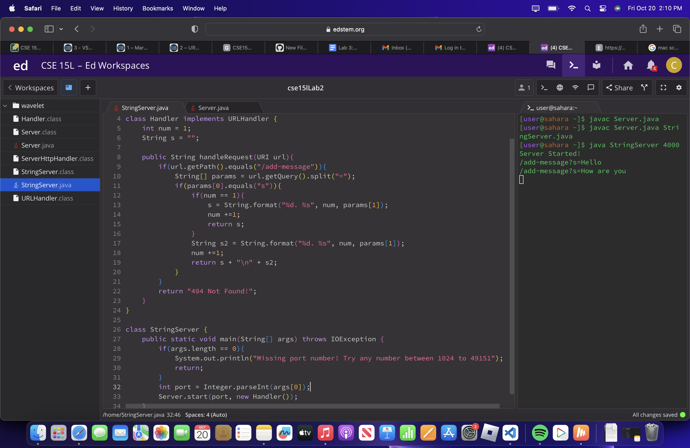
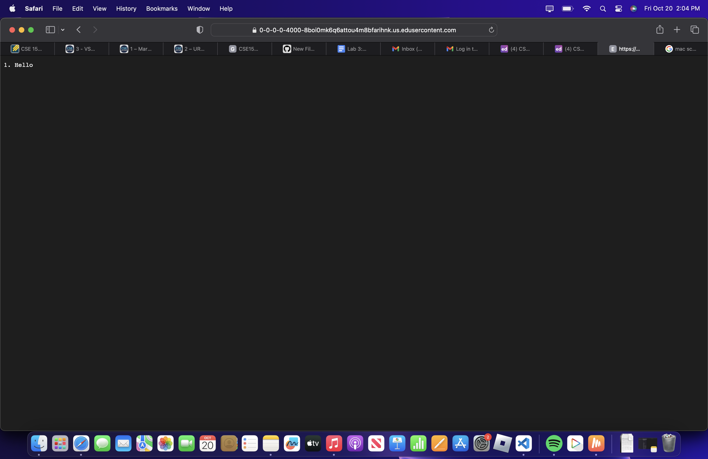
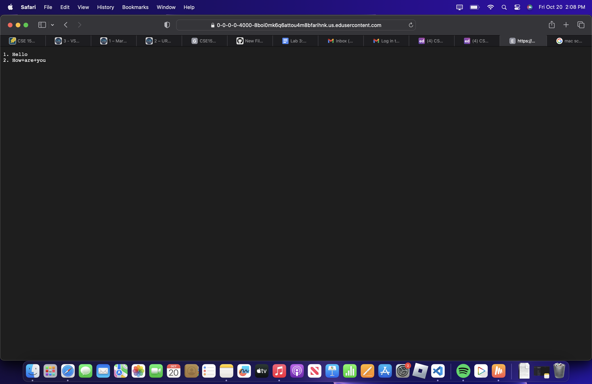
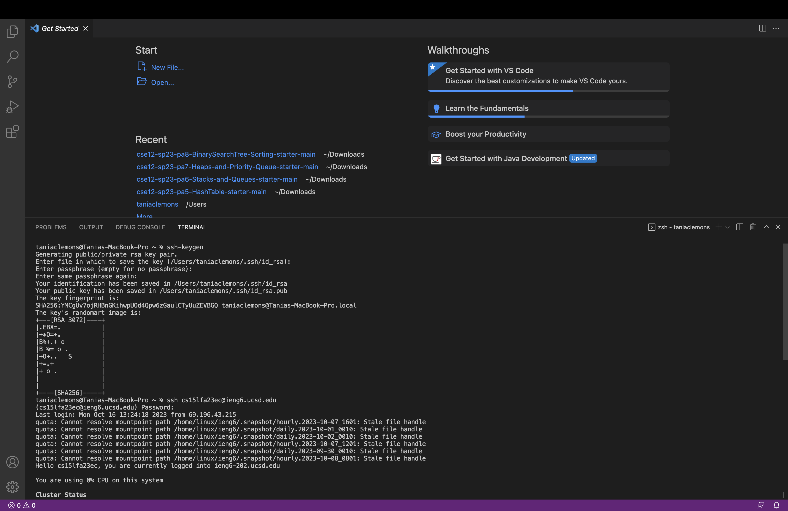
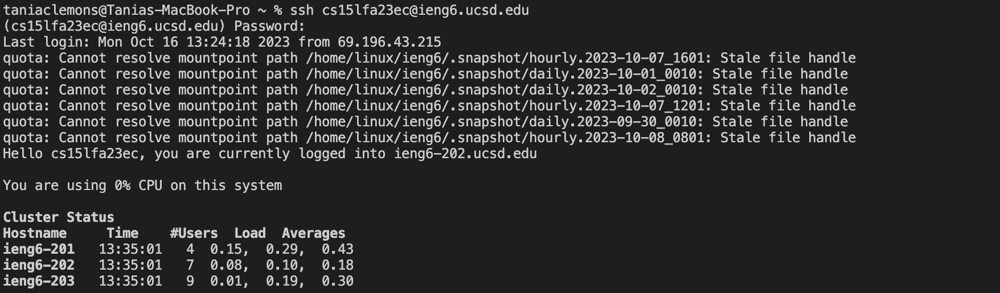
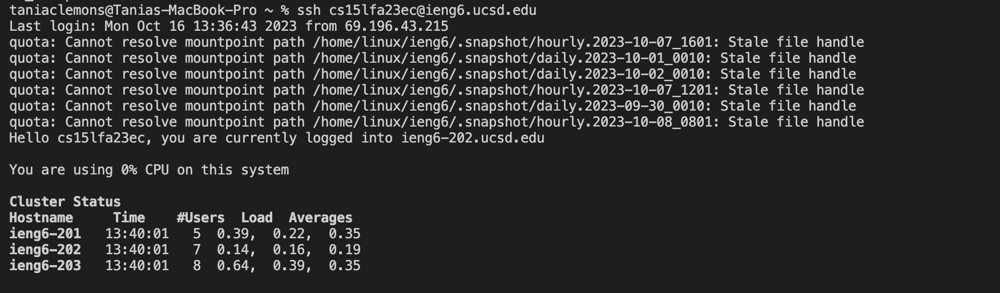

# Part 1

StringServer

The method called was handleRequest. The relevant argument to that method is the URI url which instructs the string to be added to the web server and includes the message to be added being “Hello”. The value of the relevant field of the class is int num which originally is 1 to list sequentially the number of sentences added. After this specific request, int num changed to 2 to prepare for any next string request.

The method called was handleRequest. The relevant argument to that method is the URI url which instructs the string to be added to the web server and includes the message to be added being “How are you”. The value of the relevant field of the class is int num which now is 2 to list sequentially the number of sentences added. After this specific request, int num changed to 3 to prepare for any next string request.

# Part 2

The path to the private key for your SSH key for logging into ieng6: /Users/taniaclemons/.ssh/id_rsa

The path to the public key for your SSH key for logging into ieng6: /Users/taniaclemons/.ssh/id_rsa.pub

A terminal interaction where you log into ieng6 with your course-specific account without being asked for a password

# Part 3
Something I learned from the lab in week 2 was how to create and edit a web server. This includes the different effects that came from editing the url with paths and queries.
